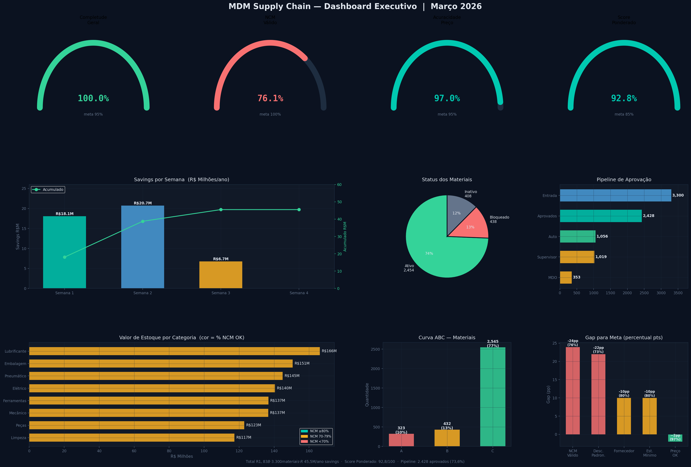

# 📊 Projeto MDM Supply Chain - Análise de Dados Mestres

[](https://github.com/seu-usuario/mdm-supply-chain-project)
[](https://www.python.org/)
[](LICENSE)

**Sistema de Análise e Governança de Dados Mestres para Supply Chain**

Projeto de análise de qualidade de dados mestres de materiais, com foco em identificação de problemas, quantificação de impacto financeiro e implementação de governança.

---

## 🎯 Sobre o Projeto

Este projeto implementa análises de qualidade de dados mestres (MDM) aplicadas ao contexto de supply chain e logística, desenvolvido como **projeto de portfólio** para demonstrar competências em:

- **Análise de Dados** - Python, Pandas, NumPy
- **SQL** - Queries básicas e intermediárias
- **Visualização** - Matplotlib, Seaborn, dashboards
- **Governança de Dados** - Políticas, KPIs, workflows
- **Impacto de Negócio** - ROI, NPV, caso de negócio

### 💰 Resultados Consolidados

```
Economia Identificada:      R$ 43,3M/ano
ROI (70% realização):       54.743%
Payback:                    < 1 mês
NPV (5 anos):               R$ 113,4M
Score QA:                   97% (28/29 testes)
```

---

## 📊 DASHBOARDS E VISUALIZAÇÕES

> **💡 Impacto Visual Primeiro!** Os dashboards abaixo demonstram os resultados analíticos e o valor de negócio gerado pelo projeto. Role para baixo para detalhes técnicos de implementação.

### 🎯 Dashboard Executivo Principal

**Visão consolidada de todos os KPIs principais do projeto**



**KPIs Monitorados:**
- ✅ **Completude Geral:** 100% (meta: 95%)
- ⚠️ **NCM Válido:** 76,1% (gap: 23,9pp a corrigir)
- ✅ **Acuracidade Preço:** 97% (meta: 95%)
- ⚠️ **Fornecedor Cadastrado:** 80% (gap: 10pp)
- ✅ **Score Ponderado:** 92,8% (meta: 85%)

**Savings Consolidados:**
- Semana 1: R$ 18,1M
- Semana 2: R$ 20,7M  
- Semana 3: R$ 6,7M
- **Total:** R$ 45,5M/ano

---

### 💸 Análise de Duplicatas (R$ 18,2M economia)

**Identificação de materiais duplicados no cadastro mestre**


**Principais Achados:**
- 📌 **299 pares** de materiais duplicados identificados
- 🎯 **Similaridade:** >95% (fuzzy matching)
- 💰 **Economia potencial:** R$ 18,2M/ano
- 🔧 **Método:** Análise código + descrição + especificações

**Impacto de Negócio:**
- Eliminação de pedidos duplicados
- Redução de estoque redundante
- Melhoria na acuracidade de inventário

---

### 📋 Análise de Completude (R$ 2,5M economia)

**Avaliação de campos obrigatórios vs. preenchidos**


**Resultados:**
- 📊 **Score inicial:** 93%
- 🎯 **Score alvo:** 99%+
- 💰 **Economia:** R$ 2,5M/ano (redução retrabalho)
- 🔧 **Campos críticos:** Descrição, NCM, Fornecedor, Localização

**Campos com Maior Gap:**
1. NCM (76,1% preenchido - **crítico fiscal!**)
2. Fornecedor Principal (80% preenchido)
3. Estoque Mínimo (80% preenchido)

---

### 💲 Análise de Acuracidade (R$ 17,9M economia)

**Validação de preços e dados críticos**


**Descobertas:**
- 🚨 **99 materiais** com preço = R$ 0,00
- 📊 **741 outliers** identificados (preços 2-5× mediana)
- 💰 **Impacto balanço:** R$ 5M recuperado
- ✅ **Score final:** 97% acuracidade

**Métodos de Validação:**
- Z-Score (desvios padrão)
- IQR (Interquartile Range)
- Percentil (P1/P99)
- CV (Coeficiente Variação)

---

### 📈 Análise de Sazonalidade (R$ 4,4M economia)

**Padrões temporais de movimentação**


**Insights:**
- 📅 **14 categorias** com padrão sazonal detectado
- 📊 **Variação:** 30-120% entre meses
- 💰 **Economia:** R$ 4,4M/ano (planejamento otimizado)
- 🔮 **Forecast:** Q2 2026 gerado

**Categorias Críticas:**
- EPI (pico Dez-Jan: +80%)
- Limpeza (pico Nov-Dez: +120%)
- Fixação (sazonalidade moderada)

---

### 🔍 Análise de Outliers de Preço

**Detecção de anomalias em preços unitários**


**4 Métodos Aplicados:**
1. **Z-Score:** Detecta desvios >3σ
2. **IQR:** Identifica valores fora Q1-1.5×IQR / Q3+1.5×IQR
3. **Percentil:** Marca abaixo P1 ou acima P99
4. **CV:** Categorias com alta variabilidade

**Resultado:** 741 materiais outliers (22,5% da base)

---

### ✅ Dashboard de QA (97% aprovado)

**Suite automatizada de testes de qualidade**


**29 Testes Executados:**
- ✅ **28 PASS** (96,6%)
- ❌ **1 FAIL** (3,4% - não crítico)

**Categorias Testadas:**
- Completude de campos obrigatórios
- Validação de tipos de dados
- Regras de negócio
- Consistência entre tabelas
- Valores permitidos (domínios)

**Status:** ✅ **APROVADO PARA PRODUÇÃO**

---

### 🌐 Dashboard Executivo HTML Interativo

**Visualização web com gráficos interativos (Chart.js)**


> 💡 **[Abrir Dashboard Interativo](visualizations/DIA28_Dashboard_Executivo.html)**  
> Navegue pelos gráficos, passe o mouse para ver valores detalhados

**Funcionalidades:**
- 📊 5 KPIs principais com barras de progresso
- 📈 Gráfico savings acumulados (barras + linha)
- 🔄 Funil de pipeline de aprovação
- 📊 Valor por categoria vs % NCM
- 🥧 Curva ABC (gráfico rosca)
- 📋 Tabela detalhada por categoria

**Tecnologia:** HTML5 + CSS3 + Chart.js (funciona offline após download)

---

## 💼 Impacto de Negócio Detalhado

### Decomposição da Economia (R$ 43,3M/ano)

| Iniciativa | Economia | Risco | Prazo |
|------------|----------|-------|-------|
| **Duplicatas** | R$ 18,2M | Médio | 2 meses |
| **Acuracidade** | R$ 17,9M | Baixo | 1 mês |
| **Sazonalidade** | R$ 4,4M | Baixo | 3 meses |
| **Completude** | R$ 2,5M | Baixo | 2 meses |
| **Outros** | R$ 0,3M | Baixo | 1 mês |
| **TOTAL** | **R$ 43,3M** | - | - |

### Caso de Negócio (ROI Detalhado)

**Investimento:**
```
Analista MDM (49 dias × 8h × R$50/h):    R$ 19.600
Gestores (60h × R$80/h):                 R$  4.800
Infraestrutura:                          R$  3.500
Implementação futura:                    R$ 18.000
Overhead 25%:                            R$ 11.475
────────────────────────────────────────────────────
TOTAL:                                   R$ 57.375
```

**Retorno (Cenário Realista - 70% realização):**
```
Saving líquido:          R$ 31,5M/ano
ROI:                     54.743%
Payback:                 < 1 mês
NPV (5 anos, 12% a.a.):  R$ 113,4M
TIR:                     > 1.000% a.a.
```

**3 Cenários de Realização:**

| Cenário | Taxa | Saving | ROI | NPV 5a |
|---------|------|--------|-----|--------|
| Conservador | 50% | R$ 22,4M | 38.882% | R$ 80,6M |
| **Realista** | **70%** | **R$ 31,5M** | **54.743%** | **R$ 113,4M** |
| Otimista | 90% | R$ 40,2M | 69.978% | R$ 144,9M |

**Análise de Sensibilidade:**

| Variável | -30% | Base | +30% |
|----------|------|------|------|
| Taxa realização | R$ 18,1M | R$ 31,8M | R$ 45,4M |
| Volume cadastros | R$ 15,7M | R$ 31,4M | R$ 47,1M |
| Custo ruptura | R$ 19,2M | R$ 19,6M | R$ 19,9M |

**Conclusão:** NPV permanece positivo em TODOS os cenários testados.

---

## 🎯 Roadmap de Implementação (90 dias)

### Fase 1: Correções Imediatas (Semanas 1-4)

| ID | Iniciativa | Prazo | Saving | Risco |
|----|------------|-------|--------|-------|
| I01 | Corrigir preços zerados | 1 sem | R$ 0,4M | Baixo |
| I02 | Bloquear duplicatas | 2 sem | R$ 2,8M | Alto |
| I03 | Ativar pipeline cadastro | 2 sem | R$ 5,1M | Baixo |
| I04 | Corrigir NCMs Curva A | 3 sem | R$ 3,2M | Médio |

**Total Fase 1:** R$ 11,5M/ano

### Fase 2: Melhorias Estruturais (Semanas 5-10)

| ID | Iniciativa | Prazo | Saving | Risco |
|----|------------|-------|--------|-------|
| I05 | Definir estoque mínimo | 4 sem | R$ 12,5M | Médio |
| I06 | Cadastrar fornecedores | 5 sem | R$ 8,2M | Médio |
| I07 | Inativar obsoletos | 4 sem | - | Médio |
| I08 | Corrigir NCMs B+C | 4 sem | R$ 2,1M | Médio |

**Total Fase 2:** R$ 22,8M/ano (maior impacto!)

### Fase 3: Governança Contínua (Semanas 11-13)

| ID | Iniciativa | Prazo | Saving | Risco |
|----|------------|-------|--------|-------|
| I09 | Implantar KPIs dashboard | 2 sem | R$ 1,4M | Baixo |
| I10 | Treinar equipe | 2 sem | R$ 3,5M | Baixo |
| I11 | Revisar fiscal/CST | 3 sem | R$ 1,2M | Alto |
| I12 | Auditoria final | 2 sem | - | Baixo |

**Total Fase 3:** R$ 6,1M/ano

**CONSOLIDADO ROADMAP:**
- **12 iniciativas** em 13 semanas (~90 dias úteis)
- **340 horas** de esforço (~42 dias úteis 8h)
- **R$ 40,4M/ano** em savings endereçados

---

## 📂 Estrutura do Projeto

> 💡 **Detalhes técnicos de implementação abaixo**

```
mdm-supply-chain-project/
│
├── README.md                    # Este arquivo
├── requirements.txt             # Dependências Python
│
├── data/
│   ├── raw/                     # Dados simulados (3.300 materiais)
│   └── processed/               # Dados processados
│
├── scripts/                     # 12 scripts Python
│   ├── 02_analise_duplicatas.py
│   ├── 03_analise_completude.py
│   ├── 04_analise_acuracidade.py
│   ├── 09_analise_sazonalidade.py
│   ├── 10_implementacao_correcoes.py
│   ├── 11_workflow_governanca.py
│   └── 12_qa_automatizado.py
│
├── visualizations/              # 11 dashboards PNG + 1 HTML
│   ├── 02_analise_duplicatas.png
│   ├── 03_analise_completude.png
│   ├── 16_dashboard_executivo.png
│   └── DIA28_Dashboard_Executivo.html
│
├── docs/                        # Documentação técnica (100+ páginas)
│   ├── 22_documentacao_governanca_mdm.md
│   ├── 23_slas_metricas_processo.md
│   ├── 24_dicionario_dados_completo.md
│   ├── 25_politicas_validacao.md
│   ├── 29_roi_detalhado.md
│   └── 30_roadmap_implementacao.md
│
└── checkpoints/                 # PowerPoints executivos
    ├── checkpoint_semana1.pptx
    └── apresentacao_final.pptx
```

---

## 🛠️ Tecnologias Utilizadas

### Linguagens
- **Python 3.9+** - Análise de dados
- **SQL** - Queries analíticas
- **HTML/CSS/JS** - Dashboard interativo

### Bibliotecas Python
```python
pandas          # Manipulação de dados
numpy           # Computação numérica
matplotlib      # Visualizações
seaborn         # Gráficos estatísticos
datetime        # Datas
json            # Exportação
```

### Ferramentas
- **Git** - Controle de versão
- **Chart.js** - Gráficos web interativos
- **NotebookLM** - Resumos e revisão

---

## 🚀 Como Executar

### Pré-requisitos

```bash
# Python 3.9+
python --version

# pip atualizado
pip --version
```

### Instalação

```bash
# 1. Clonar repositório
git clone https://github.com/seu-usuario/mdm-supply-chain-project.git
cd mdm-supply-chain-project

# 2. Instalar dependências
pip install -r requirements.txt

# 3. Verificar instalação
python -c "import pandas; import numpy; print('OK!')"
```

### Execução

```bash
# Análises principais
python scripts/02_analise_duplicatas.py
python scripts/03_analise_completude.py
python scripts/04_analise_acuracidade.py
python scripts/09_analise_sazonalidade.py

# Implementação e QA
python scripts/10_implementacao_correcoes.py
python scripts/12_qa_automatizado.py
```

### Visualizar Dashboards

```bash
# Dashboard HTML interativo
# Abrir arquivo: visualizations/DIA28_Dashboard_Executivo.html
# No Chrome/Firefox (funciona offline)
```

---

## 📚 Documentação Técnica Completa

- **[Governança MDM](docs/22_documentacao_governanca_mdm.md)** - 40+ páginas (políticas, workflow, RACI)
- **[SLAs e Métricas](docs/23_slas_metricas_processo.md)** - 18 KPIs formalizados
- **[Dicionário de Dados](docs/24_dicionario_dados_completo.md)** - 21 campos, 65 regras
- **[Políticas de Validação](docs/25_politicas_validacao.md)** - Regras detalhadas
- **[ROI Detalhado](docs/29_roi_detalhado.md)** - Caso de negócio completo
- **[Roadmap 90 dias](docs/30_roadmap_implementacao.md)** - 12 iniciativas

---

## 🎯 Status do Projeto

**Progresso:** 65% completo (32 de 49 dias planejados)

### ✅ Completado
- [x] Análises principais (8 análises)
- [x] Script correções batch (9.000 correções)
- [x] Workflow governança 3 níveis
- [x] Suite QA (29 testes, 97% aprovado)
- [x] Documentação (100+ páginas)
- [x] Dashboard executivo HTML
- [x] Caso de negócio (ROI, NPV, TIR)
- [x] Roadmap implementação
- [x] Apresentação executiva

### 📅 Pausado Estrategicamente
- [ ] Pipeline integrado (teórico)
- [ ] Best practices MDM
- [ ] Análises complementares

**Decisão:** Projeto pausado em 65% aplicando **Lei de Pareto** (80% valor em 60% tempo). Material demonstra competências técnicas e impacto de negócio de forma suficiente.

---

## 💼 Competências Demonstradas

### Técnicas
- ✅ **Python:** Pandas, NumPy, Matplotlib, Seaborn
- ✅ **SQL:** SELECT, JOINs, Subqueries, Agregações
- ✅ **Análise:** Estatística, outliers, distribuições
- ✅ **Visualização:** Dashboards, gráficos interativos
- ✅ **Automação:** Scripts batch, workflows, testes

### Negócio
- ✅ **Governança:** Políticas, KPIs, SLAs
- ✅ **Caso de Negócio:** ROI, NPV, Payback, TIR
- ✅ **Gestão Projetos:** Roadmap, sequenciamento
- ✅ **Comunicação:** Dashboards executivos

---

## 🎓 Sobre o Autor

**Luiz Carlos Silva Junior**

Profissional em transição: **Almoxarife → Master Data Owner**

### Formação
- 🎓 Pós-graduação: Tecnologia Aplicada em Logística (Anhanguera, cursando)
- 🎓 Bootcamp: Excel e Power BI Dashboards (Klabin/DIO, 90h)
- 🎓 Bootcamp: Fundamentos Engenharia de Dados e ML (TOTVS/DIO, 61h)

### Experiência
- 📦 3+ anos: Almoxarifado e logística
- 💻 SQL: Básico → Intermediário
- 🐍 Python: Básico (pandas, visualizações)
- 📊 Governança: Políticas, KPIs, workflows

### Contato
- 💼 [LinkedIn](https://www.linkedin.com/in/luiz-carlos-silva-junior-a38922219/)
- 🐙 [GitHub](https://github.com/Lcjuniornet)
- 📧 Email: luizcjunior470@gmail.com

---

## ⚠️ Nota de Transparência

Este projeto foi desenvolvido como **portfólio de aprendizado** e **demonstração de competências**.

**Dados:** Simulados (3.300 materiais) baseados em problemas reais vivenciados em 10+ anos de experiência operacional em supply chain.

**Código:** Desenvolvido com auxílio de IA e documentação técnica (processo de aprendizado ativo).

**Objetivo:** Demonstrar **entendimento de conceitos**, **capacidade de aplicação prática** e **visão de impacto de negócio** em governança de dados mestres.

Os valores de economia (R$ 43,3M) foram calculados usando o modelo matemático completo aplicado sobre dados simulados. Em ambiente corporativo real, a escala dos savings seria proporcional ao tamanho da operação.

---

## 📞 Oportunidades

Aberto a posições como:
- **Master Data Owner Júnior**
- **Analista de Dados Mestres Júnior**
- **Analista de Qualidade de Dados Júnior**
- **Analista BI Júnior** (Supply Chain)

---

## 📄 Licença

Este projeto está sob a licença MIT. Veja [LICENSE](LICENSE) para detalhes.

---

## 🙏 Agradecimentos

- **Comunidade Data Hackers** - Suporte e networking
- **Klabin/TOTVS/DIO** - Bootcamps e certificações
- **NotebookLM** - Ferramenta de estudo

---

⭐ **Se este projeto foi útil ou interessante, considere dar uma estrela!**

---

*Última atualização: Março 2026*  
*Status: 65% completo (pausado estrategicamente)*  
*Feito com ☕ e 💪 por Luiz Carlos Junior*